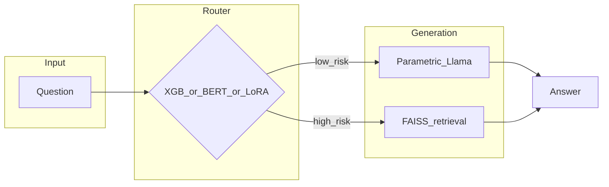

# Biomedical adaptive RAG

A **router** decides whether to answer a biomedical question with **Llama 3.1 8B** alone or with **retrieval** over a **FAISS** index of PubMed-style abstracts. Routers are trained from **MedHallu**-style prompts with weak labels from embedding similarity, then compared on a **PubMedQA** adaptive benchmark.

This repo is a **course project** (USC CSCI 544) and a **portfolio** artifact: a small `src/` library, numbered `scripts/` pipeline steps, and a single **`main.py`** entrypoint plus [`notebooks/pipeline.ipynb`](notebooks/pipeline.ipynb) for the same flow in Jupyter.

Write-up: [CSCI544_FinalReport.pdf](CSCI544_FinalReport.pdf) (methods, related work, full tables).

---

## Results (reference run)

The table below is a **fixed reference configuration** from this codebase: **PubMedQA `pqa_labeled`**, **100** questions (`seed=42`), answer “correct” if `final_decision` (`yes` / `no` / `maybe`) appears as a substring in the model output (same heuristic as the original Colab experiment). Adaptive systems route between parametric and RAG using each router’s confidence thresholds in `run_shootout` (defaults: XGBoost 0.70, DistilBERT / LoRA 0.75).

| System | Accuracy | Notes |
|--------|----------|--------|
| Vanilla LLM (always parametric) | **53%** | No retrieval |
| Always RAG | **78%** | Upper bound on this metric (heavy context) |
| **Adaptive + XGBoost router** | **69%** | Best **end-to-end** adaptive tradeoff in this run |
| Adaptive + DistilBERT router | **51%** | Very high RAG bypass in this run; hurts accuracy here |
| Adaptive + Llama LoRA router | **61%** | Middle ground |

**Router-only validation** on the held-out **MedHallu CSV** split was about **74.3%** (XGBoost) vs **74.7%** (DistilBERT)—so headline “XGBoost wins” refers to the **adaptive PubMedQA** column above, not that narrow accuracy tie.

Reproduce: `python main.py final --n-samples 100` (after artifacts exist, or let `final` build missing steps 02–05). Optional: `--csv-out artifacts/shootout_last.csv`.

---

## Architecture



---

## Tech stack

Python 3.10+, **PyTorch**, **Transformers**, **PEFT** (LoRA), **sentence-transformers**, **FAISS (CPU)**, **XGBoost**, **scikit-learn**, **Datasets** (Hugging Face). **Linux + NVIDIA GPU** recommended for Llama 8B training and evaluation.

---

## Setup

```bash
git clone <this-repo>
cd <this-repo>
python3 -m venv .venv && source .venv/bin/activate
pip install -U pip && pip install -r requirements.txt
pip install -e .   # optional; or export PYTHONPATH="$(pwd)/src"
```

Gated Llama weights: set **`HF_TOKEN`** or `huggingface-cli login`.

---

## Run (`main.py`)

From the repo root:

| Command | Purpose |
|--------|---------|
| `python main.py final` | If anything is missing under `data/` / `artifacts/`, runs **scripts 02→05** (MedHallu CSV, LoRA, FAISS, XGB + optional DistilBERT), then runs the **PubMedQA shootout** (same outcome as `scripts/06`). |
| `python main.py final --skip-build` | **Fail fast** if CSV, LoRA, FAISS, or XGB joblib is missing (no automatic build). |
| `python main.py probe` | Hidden-state linear probe on HaluEval (`scripts/01`). Use `--model-id`, `--tasks`, `--max-samples`, `--hf-token` as needed. |
| `python main.py text-baselines` | Classical HaluEval baselines (`scripts/00`); `--task qa|dialogue|summarization`, `--method tfidf|ngram`. |

Useful flags on **`final`**: `--model-id` (same base for steps **02 / 03 / shootout**; default Llama from config), `--medhallu-max-rows N` (optional; forwards to script **02** as `--max-rows` — **omit for full MedHallu**, which is the default course/TA path), `--n-samples`, `--csv-out`, `--no-xgb`, `--no-bert`, `--epochs`, `--batch-size` (MedHallu), `--faiss-batch-size`, `--skip-bert` (for step 05), `--hf-token`.

Script **02** also accepts `--max-rows N` directly when run standalone.

**Quick checks:** `python scripts/verify_imports.py` (imports / syntax, no downloads). `python scripts/verify_minimal_train.py` (single optimizer step through LoRA `Trainer`; uses a tiny temp CSV and `TinyLlama` by default). Script **03** accepts `--max-train-steps N` for a short run on a real CSV.

---

## Repository layout

| Path | Role |
|------|------|
| [`main.py`](main.py) | Primary CLI: `final`, `probe`, `text-baselines` |
| [`src/adaptive_rag/`](src/adaptive_rag/) | Library (data gen, training, FAISS, shootout, [`orchestrate.py`](src/adaptive_rag/orchestrate.py) for artifact checks + subprocess to 02–05) |
| [`scripts/`](scripts/) | Numbered pipeline steps `00`–`06` (granular reruns and debugging) |
| [`notebooks/pipeline.ipynb`](notebooks/pipeline.ipynb) | Jupyter mirror: ensure artifacts + shootout; optional probe / baseline cells |
| `data/`, `artifacts/` | Generated CSV, FAISS, adapters, joblibs (see `.gitkeep` where present) |
| [`legacy_notebooks/`](legacy_notebooks/) | Archived original Colab exports (not imported by the main code path) |

Any local copies of **`MasterVerification*.ipynb`** are **gitignored** by default (optional private verification notebooks; not part of the public workflow).

---

## Pipeline scripts (`scripts/`)

| Step | Command | Purpose |
|------|---------|---------|
| 0 (opt) | `python scripts/00_text_baselines_haluval.py --task qa --method tfidf` | HaluEval text baselines |
| 1 (opt) | `python scripts/01_internal_state_probe.py --tasks qa --max-samples 800` | Hidden-state linear probe (default Qwen; set `PROBE_MODEL_ID` for Llama) |
| 2 | `python scripts/02_generate_medhallu_router_csv.py` | Build `data/medhallu_lora_training_data_batch.csv` (optional `--max-rows N` for a prefix of the split) |
| 3 | `python scripts/03_train_lora_router.py` | LoRA sequence classifier on Llama |
| 4 | `python scripts/04_build_pubmed_faiss.py` | FAISS index + mapping under `artifacts/` |
| 5 (opt) | `python scripts/05_train_baseline_routers.py` | XGBoost joblib + DistilBERT folder |
| 6 | `python scripts/06_adaptive_rag_shootout.py --n-samples 100` | Shootout only (assumes artifacts already exist) |

`python main.py final` orchestrates **02→05** when needed, then runs the same shootout logic as step **06**.

---

## Artifacts and environment

- **`data/`** — MedHallu router training CSV (from script 02). Override root with **`ADAPTIVE_RAG_DATA`**.
- **`artifacts/`** — LoRA adapter dir, FAISS index + mapping, `xgb_router.joblib`, optional DistilBERT folder. Override with **`ADAPTIVE_RAG_ARTIFACTS`**.
- **`ADAPTIVE_RAG_GENERATOR_MODEL`** — generator for script 02 (default Llama 3.1 8B Instruct).

First full **`main.py final`** build can take **many hours** (MedHallu generations, LoRA training, full PubMed FAISS, baselines).

---

## Troubleshooting

- **401 / Llama access:** Accept the model license on Hugging Face and export **`HF_TOKEN`**.
- **403 Forbidden on `meta-llama/...`:** Your token is valid but **cannot read gated repos**. With a **fine-grained** Hugging Face token, enable **“Access to public gated repositories”** in [token settings](https://huggingface.co/settings/tokens), or use a **classic** token with read access.
- **OOM:** Lower batch sizes in scripts 02–03; reduce `--n-samples` for quick runs.
- **`Trainer` / tokenizer API:** If a newer `transformers` requires `processing_class=` instead of `tokenizer=`, adjust [`train_lora_router.py`](src/adaptive_rag/train_lora_router.py) and [`router_baselines.py`](src/adaptive_rag/router_baselines.py).
- **PEFT / `torchao` version error on Colab** (`Found an incompatible version of torchao…`): the runtime image may ship an old `torchao` while `peft` expects ≥0.16 or no `torchao`. Run `pip uninstall -y torchao` (standard LoRA does not need it) or `pip install -U 'torchao>=0.16'`. The same failure can appear for **`python main.py final`** or **`scripts/03`** if your environment has that conflict—it is not specific to notebooks.

---

## Course

University of Southern California — **CSCI 544** (Spring 2026). Dataset licenses and citations are in the PDF.
