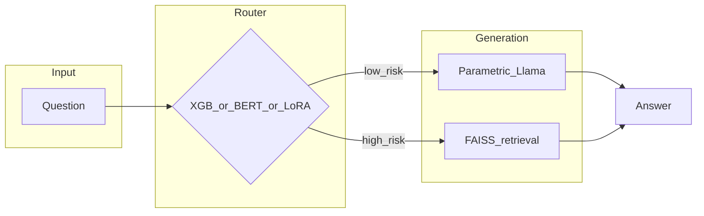

# Biomedical adaptive RAG

A **router** decides whether to answer a biomedical question with **Llama 3.1 8B** alone or with **retrieval** over a **FAISS** index of PubMed-style abstracts. Routers are trained from **MedHallu**-style prompts with weak labels from embedding similarity, then compared on a **PubMedQA** adaptive benchmark.

This repo is a **course project** (USC CSCI 544) and a **portfolio** artifact: a small `src/` library, numbered `scripts/` pipeline steps, and a single **`main.py`** entrypoint plus [`notebooks/pipeline.ipynb`](notebooks/pipeline.ipynb) for the same flow in Jupyter.

Write-up: [CSCI544_FinalReport.pdf](CSCI544_FinalReport.pdf) (methods, related work, full tables).

---

## Results (reference run)

The table below is a **fixed reference configuration** from this codebase: **PubMedQA `pqa_labeled`**, **100** questions (`seed=42`), answer “correct” if `final_decision` (`yes` / `no` / `maybe`) appears as a substring in the model output (same heuristic as the original Colab experiment). Adaptive systems route between parametric and RAG using each router’s confidence thresholds in `run_shootout` (defaults: XGBoost 0.70, DistilBERT / LoRA 0.75).

| System | Accuracy | Notes |
|--------|----------|--------|
| Vanilla LLM (always parametric) | **53%** | No retrieval |
| Always RAG | **78%** | Upper bound on this metric (heavy context) |
| **Adaptive + XGBoost router** | **69%** | Best **end-to-end** adaptive tradeoff in this run |
| Adaptive + DistilBERT router | **51%** | Very high RAG bypass in this run; hurts accuracy here |
| Adaptive + Llama LoRA router | **61%** | Middle ground |

**Router-only validation** on the held-out **MedHallu CSV** split was about **74.3%** (XGBoost) vs **74.7%** (DistilBERT)—so headline “XGBoost wins” refers to the **adaptive PubMedQA** column above, not that narrow accuracy tie.

Reproduce: `python main.py final --n-samples 100` (after artifacts exist, or let `final` build missing steps 02–05). Optional: `--csv-out artifacts/shootout_last.csv`.

---

## Architecture



---

## Tech stack

Python 3.10+, **PyTorch**, **Transformers**, **PEFT** (LoRA), **sentence-transformers**, **FAISS (CPU)**, **XGBoost**, **scikit-learn**, **Datasets** (Hugging Face). **Linux + NVIDIA GPU** recommended for Llama 8B training and evaluation.

---

## Setup

```bash
git clone <this-repo>
cd <this-repo>
python3 -m venv .venv && source .venv/bin/activate
pip install -U pip && pip install -r requirements.txt
pip install -e .   # optional; or export PYTHONPATH="$(pwd)/src"
```

Gated Llama weights: set **`HF_TOKEN`** or `huggingface-cli login`.

---

## Run (`main.py`)

From the repo root:

| Command | Purpose |
|--------|---------|
| `python main.py final` | If anything is missing under `data/` / `artifacts/`, runs **scripts 02→05** (MedHallu CSV, LoRA, FAISS, XGB + optional DistilBERT), then runs the **PubMedQA shootout** (same outcome as `scripts/06`). |
| `python main.py final --skip-build` | **Fail fast** if CSV, LoRA, FAISS, or XGB joblib is missing (no automatic build). |
| `python main.py probe` | Hidden-state linear probe on HaluEval (`scripts/01`). |
| `python main.py text-baselines` | Classical HaluEval baselines (`scripts/00`). |

Use `python main.py <subcommand> --help` for the full parser text. Reference tables below match [`main.py`](main.py).

### `main.py final` — flags

| Flag | Default | Meaning |
|------|---------|---------|
| `--skip-build` | off | If set, do not run scripts 02–05; exit if any required artifact is missing. |
| `--hf-token` | env `HF_TOKEN` | Hugging Face token for gated models / Hub (also passed to subprocesses when set here). |
| `--batch-size` | `16` | MedHallu batch size (forwarded to script **02**). |
| `--faiss-batch-size` | `256` | Embedding batch size for PubMed FAISS (script **04**). |
| `--epochs` | `2` | LoRA training epochs (script **03**). |
| `--model-id` | env `ADAPTIVE_RAG_GENERATOR_MODEL` or config default | Same **causal LM** id for CSV gen (**02**), LoRA base (**03**), and shootout generator + LoRA base (**06**). |
| `--medhallu-max-rows N` | unset | If set, only the **first N** MedHallu rows in script **02** (omit for full ~9k-row split). |
| `--skip-bert` | off | Passed to script **05** as `--skip-bert` (skip DistilBERT router training). |
| `--n-samples` | `100` | PubMedQA questions in the shootout. |
| `--csv-out PATH` | unset | Optional path to save the shootout metrics table as CSV. |
| `--no-xgb` | off | Do not load `xgb_router.joblib`; shootout skips adaptive XGBoost column. |
| `--no-bert` | off | Skip DistilBERT router in the shootout even if the artifact dir exists. |
| `--faiss-index PATH` | `artifacts/...` from config | Override FAISS index path. |
| `--faiss-mapping PATH` | `artifacts/...` from config | Override FAISS id/text mapping pickle. |
| `--lora-adapter PATH` | `artifacts/llama3-medhallu-router` from config | LoRA adapter directory for shootout (and readiness check). |
| `--distilbert-dir PATH` | `artifacts/distilbert_router` from config | DistilBERT router directory for shootout. |
| `--xgb-path PATH` | `artifacts/xgb_router.joblib` from config | XGBoost classifier joblib for shootout. |

### `main.py probe` — flags

| Flag | Default | Meaning |
|------|---------|---------|
| `--model-id` | env `PROBE_MODEL_ID` or `Qwen/Qwen2.5-3B-Instruct` | Causal LM for hidden-state probe (script **01**). |
| `--tasks` | `qa dialogue summarization` | HaluEval tasks (space-separated list after `--tasks`). |
| `--max-samples N` | unset | Cap samples per task (script **01**). |
| `--hf-token` | env `HF_TOKEN` | Hugging Face token if the probe model is gated. |


---

## Repository layout

| Path | Role |
|------|------|
| [`main.py`](main.py) | Primary CLI: `final`, `probe`, `text-baselines` |
| [`src/adaptive_rag/`](src/adaptive_rag/) | Library (data gen, training, FAISS, shootout, [`orchestrate.py`](src/adaptive_rag/orchestrate.py) for artifact checks + subprocess to 02–05) |
| [`scripts/`](scripts/) | Numbered pipeline steps `00`–`06` (granular reruns and debugging) |
| [`notebooks/pipeline.ipynb`](notebooks/pipeline.ipynb) | Jupyter mirror: ensure artifacts + shootout; optional probe / baseline cells |
| `data/`, `artifacts/` | Generated CSV, FAISS, adapters, joblibs (see `.gitkeep` where present) |
| [`legacy_notebooks/`](legacy_notebooks/) | Archived original Colab exports (not imported by the main code path) |


---


## Artifacts and environment

- **`data/`** — MedHallu router training CSV (from script 02). Override root with **`ADAPTIVE_RAG_DATA`**.
- **`artifacts/`** — LoRA adapter dir, FAISS index + mapping, `xgb_router.joblib`, optional DistilBERT folder. Override with **`ADAPTIVE_RAG_ARTIFACTS`**.
- **`ADAPTIVE_RAG_GENERATOR_MODEL`** — generator for script 02 (default Llama 3.1 8B Instruct).

First full **`main.py final`** build can take **many hours** (MedHallu generations, LoRA training, full PubMed FAISS, baselines).

---


## Course

University of Southern California — **CSCI 544** (Spring 2026). Dataset licenses and citations are in the PDF.
