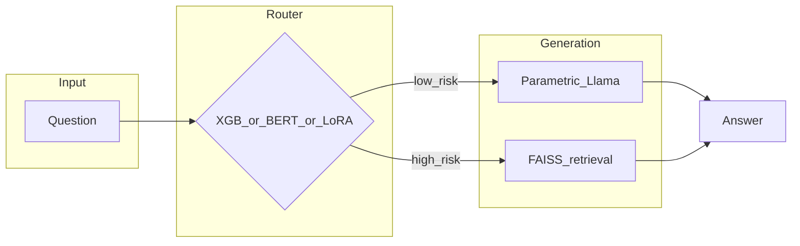

# Biomedical adaptive RAG

A **router** decides whether to answer a biomedical question with **Llama 3.1 8B** alone or with **retrieval** over a **FAISS** index of PubMed-style abstracts. Routers are trained from **MedHallu**-style prompts with weak labels from embedding similarity, then compared on a **PubMedQA** adaptive benchmark.

This repo doubles as a **course project** (USC CSCI 544) and a **portfolio** artifact: clean `src/` layout, numbered pipeline scripts, paired notebooks + `examples/` scripts, and an optional local-only verification notebook template.

Write-up: [CSCI544_FinalReport.pdf](CSCI544_FinalReport.pdf) (methods, related work, full tables).

---

## Results (reference run)

The table below is a **fixed reference configuration** from this codebase: **PubMedQA `pqa_labeled`**, **100** questions (`seed=42`), answer “correct” if `final_decision` (`yes` / `no` / `maybe`) appears as a substring in the model output (same heuristic as the original Colab experiment). Adaptive systems route between parametric and RAG using each router’s confidence thresholds in `run_shootout` (defaults: XGBoost 0.70, DistilBERT / LoRA 0.75).

| System | Accuracy | Notes |
|--------|----------|--------|
| Vanilla LLM (always parametric) | **53%** | No retrieval |
| Always RAG | **78%** | Upper bound on this metric (heavy context) |
| **Adaptive + XGBoost router** | **69%** | Best **end-to-end** adaptive tradeoff in this run |
| Adaptive + DistilBERT router | **51%** | Very high RAG bypass in this run; hurts accuracy here |
| Adaptive + Llama LoRA router | **61%** | Middle ground |

**Router-only validation** on the held-out **MedHallu CSV** split (same notebook source) was about **74.3%** (XGBoost) vs **74.7%** (DistilBERT)—so headline “XGBoost wins” refers to the **adaptive PubMedQA** column above, not that narrow accuracy tie.

Reproduce or refresh: `python scripts/06_adaptive_rag_shootout.py --n-samples 100` (optionally `--csv-out artifacts/shootout_last.csv`).

---

## Architecture



---

## Tech stack

Python 3.10+, **PyTorch**, **Transformers**, **PEFT** (LoRA), **sentence-transformers**, **FAISS (CPU)**, **XGBoost**, **scikit-learn**, **Datasets** (Hugging Face). **Linux + NVIDIA GPU** recommended for Llama 8B training and evaluation.

---

## Setup

```bash
git clone <this-repo>
cd <this-repo>
python3 -m venv .venv && source .venv/bin/activate
pip install -U pip && pip install -r requirements.txt
pip install -e .   # optional; or export PYTHONPATH="$(pwd)/src"
```

Gated Llama weights: set `HF_TOKEN` or `huggingface-cli login`.

---

## Jupyter vs Python

| If you prefer… | Use |
|----------------|-----|
| Narrative + Colab / VS Code interactive | [notebooks/overview.ipynb](notebooks/overview.ipynb), [notebooks/adaptive_rag_demo.ipynb](notebooks/adaptive_rag_demo.ipynb) |
| Terminal, CI, or “no notebook” | [examples/overview_main.py](examples/overview_main.py), [examples/adaptive_rag_demo.py](examples/adaptive_rag_demo.py) |

Same logic lives in **`src/adaptive_rag/`**; notebooks and `examples/` are thin wrappers.

---

## Pipeline scripts (`scripts/`)

| Step | Command | Purpose |
|------|---------|---------|
| 0 (opt) | `python scripts/00_text_baselines_haluval.py --task qa --method tfidf` | HaluEval text baselines |
| 1 (opt) | `python scripts/01_internal_state_probe.py --tasks qa --max-samples 800` | Hidden-state linear probe (default Qwen; set `PROBE_MODEL_ID` for Llama) |
| 2 | `python scripts/02_generate_medhallu_router_csv.py` | Build `data/medhallu_lora_training_data_batch.csv` |
| 3 | `python scripts/03_train_lora_router.py` | LoRA sequence classifier on Llama |
| 4 | `python scripts/04_build_pubmed_faiss.py` | FAISS index + mapping under `artifacts/` |
| 5 (opt) | `python scripts/05_train_baseline_routers.py` | XGBoost joblib + DistilBERT folder |
| 6 | `python scripts/06_adaptive_rag_shootout.py --n-samples 100` | Full shootout; add `--csv-out path.csv` for a table file |

---

## Master verification (shootout parity check)

**Local (gitignored copy):** Copy **`MasterVerification.TEMPLATE.ipynb`** → **`MasterVerification.ipynb`** (gitignored). Use `HF_TOKEN` in the environment, not in committed cells. Run after scripts 02–04 (and 05 for DistilBERT in the full table).

**Google Colab (standalone):** Open **`MasterVerification_COLAB.ipynb`** in Colab. Set `REPO_URL` to a branch that contains this repo, add the Colab secret **`HF_TOKEN`**, then **Runtime → Run all**. The notebook clones the repo, installs `requirements.txt`, prepends `src/` to `PYTHONPATH`, and runs the same shootout logic as the template. Point **`ADAPTIVE_RAG_ARTIFACTS`** / **`ADAPTIVE_RAG_DATA`** at Drive if large artifacts are not in the clone, or flip **`RUN_PIPE`** in the optional cell to build them in-session (slow).

---

## Layout

| Path | Role |
|------|------|
| `src/adaptive_rag/` | Library |
| `scripts/` | Full pipeline CLIs |
| `notebooks/` | Jupyter demos paired with `examples/` |
| `examples/` | Python twins of those notebooks |
| `data/`, `artifacts/` | Generated data and checkpoints (see `.gitkeep`) |
| `legacy_notebooks/` | Archived original Colab exports (not imported by the main code path) |
| `MasterVerification.TEMPLATE.ipynb` | Copy to gitignored `MasterVerification.ipynb` for a local shootout check |
| `MasterVerification_COLAB.ipynb` | Colab-first: clone repo, install deps, run the same shootout (set `REPO_URL` + secret `HF_TOKEN`) |

---

## Troubleshooting

- **401 / Llama access:** Accept the model license on Hugging Face and export `HF_TOKEN`.
- **OOM:** Lower batch sizes in scripts 02–03; reduce `--n-samples` for demos.
- **`Trainer` / tokenizer API:** If a newer `transformers` requires `processing_class=` instead of `tokenizer=`, adjust [train_lora_router.py](src/adaptive_rag/train_lora_router.py) and [router_baselines.py](src/adaptive_rag/router_baselines.py).

---

## Course

University of Southern California — **CSCI 544** (Spring 2026). Dataset licenses and citations are in the PDF.
